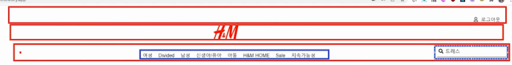

# React Router 이용해서 쇼핑몰 웹사이트 만들기

## Step
1. 전체 상품 페이지, 로그인 페이지, 상품 상세 페이지 => 총 3개 페이지  
1-1. navigation bar(Navbar) 만들기  

	- `<div/>` 3개
	- 1번 `<div/>`에는 아이콘, 로그인/아웃 버튼
	- 2번 `<div/>`에는 HNM 로고
	- 3번 `<div/>`에는 카테고리, 검색창
	- [icon 구하는 웹사이트 : fontawesome/react](https://docs.fontawesome.com/v5/web/use-with/react)

2. 전체 상품 페이지에서는 전체 상품을 볼 수 있다.
	- 작은 Json server 만들기
	- [Json-server npm 사이트](https://www.npmjs.com/package/json-server)
	- Jsonserver가 1버전으로 업데이트가 되었는데 최신버전이 불안정하다는 이슈가 있어서 0버전대 사용함
	```shell script
	npm i json-server@0.17.4
	```  
2-1. Product Card 만들기  
	- 필요한 것 : img, choice, 제목, 가격, 신제품  
	- 카드들은 중앙배열  
	- 한 줄에 카드를 4개씩 보여줌  
	- 반응형 ui로 화면사이즈가 작아지면 하나씩 보이게 됨  
	- react bootstrap 이용  

3. 로그인 버튼을 누르면 로그인 페이지가 나온다.  
3-1. 로그인 페이지 만들기
	- react-bootstrap 이용
	- `<Form/>` 이용
	- `<Form><Button type=submit/></Form>`
	- Form 내부의 Button type이 submit일 때 버튼을 클릭하면 새로고침이 된다.
	- 새로고침을 방지하기 위해서 onSubmit 시 `event.preventDefault()` 사용  

4. 상품 디테일을 눌렀으나, 로그인이 안되었으면 로그인 페이지가 먼저 나온다.  
5. 로그인이 되어있으면 상품 디테일 페이지를 볼 수 있다.  
6. 로그아웃 버튼을 클릭하면 로그아웃이 된다.  
7. 로그아웃이 되면 상품 디테일 페이지를 볼 수 없다. 다시 로그인 페이지가 나온다.  
8. 로그인을 하면 로그아웃이 보이고 로그아웃을 하면 로그인이 보임  
9. 상품을 검색할 수 있다.  

번외) 배포하기
- [My Json server 구축 링크](https://my-json-server.typicode.com/)
- Netlify에서 배포 [Netlify 링크](https://www.netlify.com/)
	- netlify 배포 시 빌드 option Build command : CI=false npm run build 로 수정 후 배포
- [CY shopping app](https://lighthearted-cajeta-5196f6.netlify.app/)